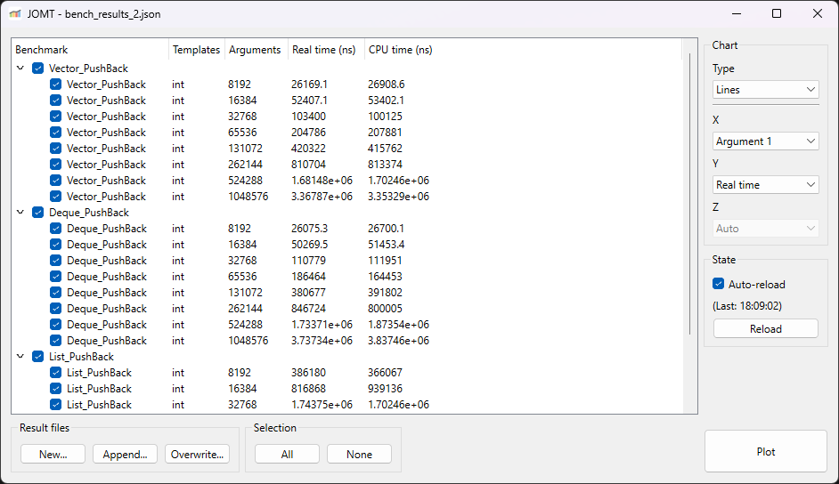
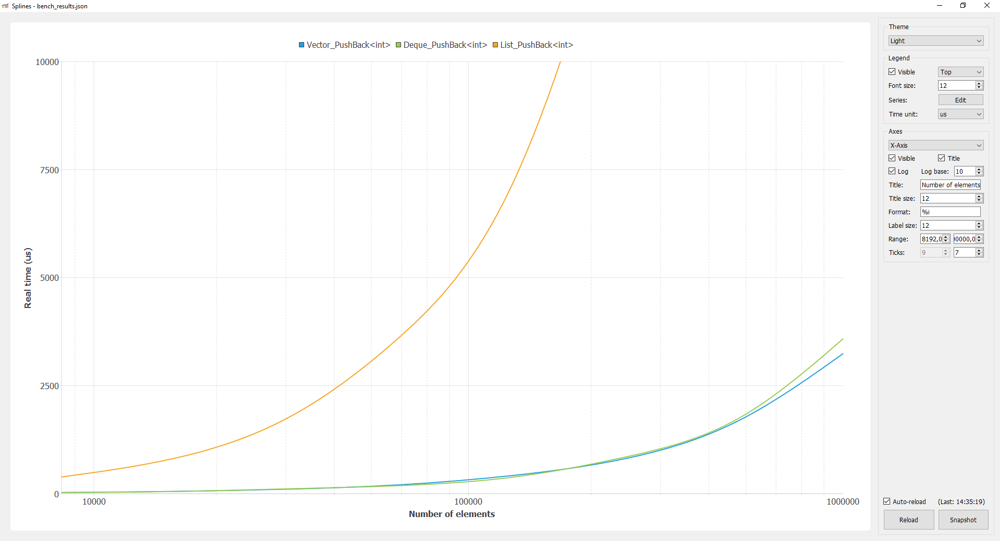
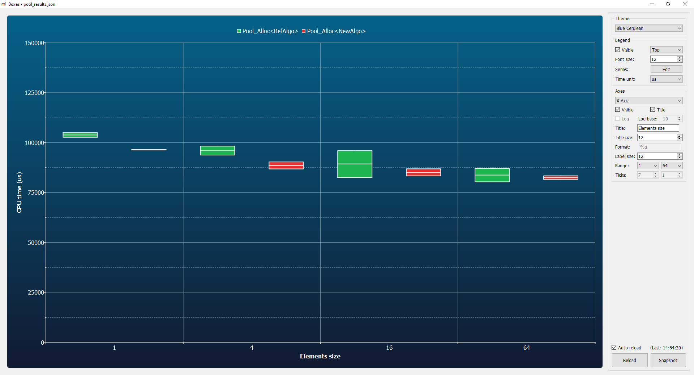
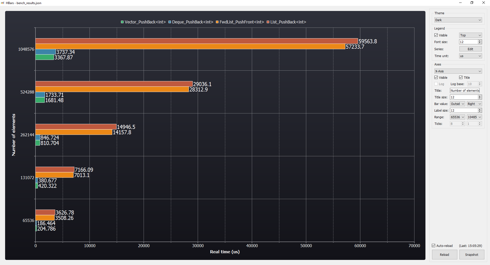
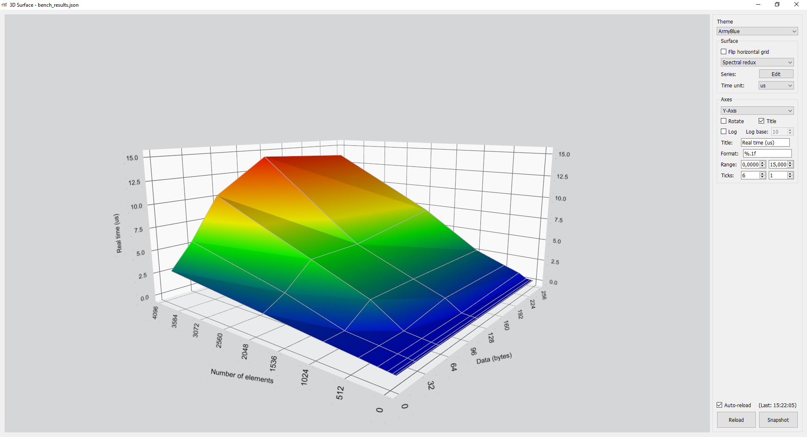
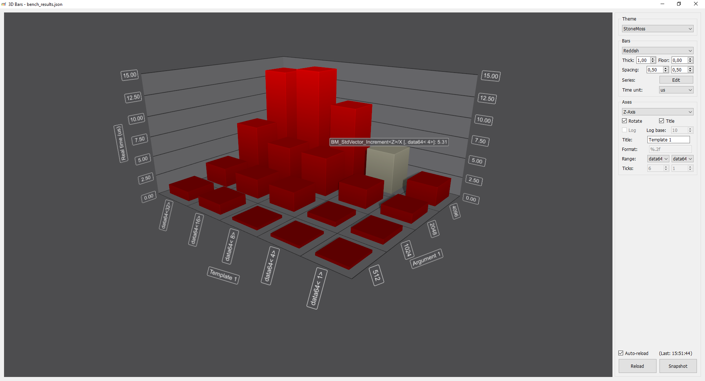

# JOMT

Visualization tool for Google benchmark results.

Built upon Qt6 Charts and DataVisualization modules.








### Features

- Parse Google benchmark results as json files
- Support old naming format and aggregate data (min, median, mean, stddev/cv)
- Multiple 2D and 3D chart types
- Benchmarks and axes selection
- Plotting options (theme, ranges, logarithm, labels, units, baseline, ...)
- Auto-reload and preferences saving

### Command line

Direct chart plotting with parameters is available through command line options.

```
Options:
  -?, -h, --help                   Displays this help.
  -v, --version                    Displays version information.
  --ct, --chart-type <chart_type>  Chart type (e.g. Lines, Boxes, 3DBars)
  --cx, --chart-x <chart_x>        Chart X-axis (e.g. a1, t2)
  --cy, --chart-y <chart_y>        Chart Y-axis (e.g. CPUTime, Bytes,
                                   RealMeanTime, ItemsMin)
  --cz, --chart-z <chart_z>        Chart Z-axis (e.g. auto, a2, t1)
  --ap, --append <files...>        Files to append by renaming (uses ';' as
                                   separator)
  --ow, --overwrite <files...>     Files to append by overwriting (uses ';' as
                                   separator)

Arguments:
  file                             Benchmark results file in json to parse.
```

### Building

Supports GCC/MinGW and MSVC builds through CMake.

You may need to install Qt dev libraries, if not already available.
See : https://doc.qt.io/qt-6/get-and-install-qt.html

Then just open 'CMakeLists.txt' with a compatible IDE (like QtCreator) or use command line:

    $ cd jomt
    $ mkdir build
    $ cd build
    $ cmake ..
    $ make <target> -j

### License

As the Qt modules it uses, this application is licensed under *GNU GPL-3.0-or-later*.
